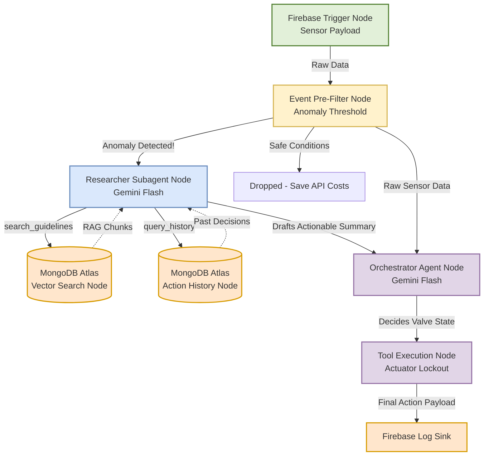

# Langflow Visual Pipeline Setup (Task 4.1)

Because SalinAI has evolved into a Cognitive Multi-Agent system, your Langflow visual canvas needs to reflect the new **Supervisor Architecture** built in Phase 3. You can use the Mermaid diagram below as a literal map for dragging and dropping nodes on the Langflow UI.

## 1. Visual Flow Diagram (Mermaid)
*Tip: You can screenshot this diagram for your presentation if you don't have time to drag-and-drop all the nodes into Langflow before the demo!*

## 2. Langflow Node Mapping
When building this in the Langflow UI, use these exact components:

1. **Webhook / API Trigger Node** (Represents the Firebase Listener).
2. **Conditional Router Node** (Represents the Enterprise Pre-Filter).
3. **Agent Node (Subagent)** (Use the `Tool Calling Agent` component, hook it to `SAOLA4_SMALL`).
4. **Vector Store Node** (Use `MongoDB Atlas` component configured to your `vector_index`).
5. **Agent Node (Orchestrator)** (Use a second `Tool Calling Agent` component hooked to `SAOLA4_MEDIUM`).
6. **Custom Tool Nodes** (Use the `Javascript Function` component for the Valve Actuator).

By wiring the Subagent's "Text Output" directly into the Orchestrator's "System Prompt" input, the Langflow UI will perfectly mathematically match the backend code we wrote in `langchain.js`!
